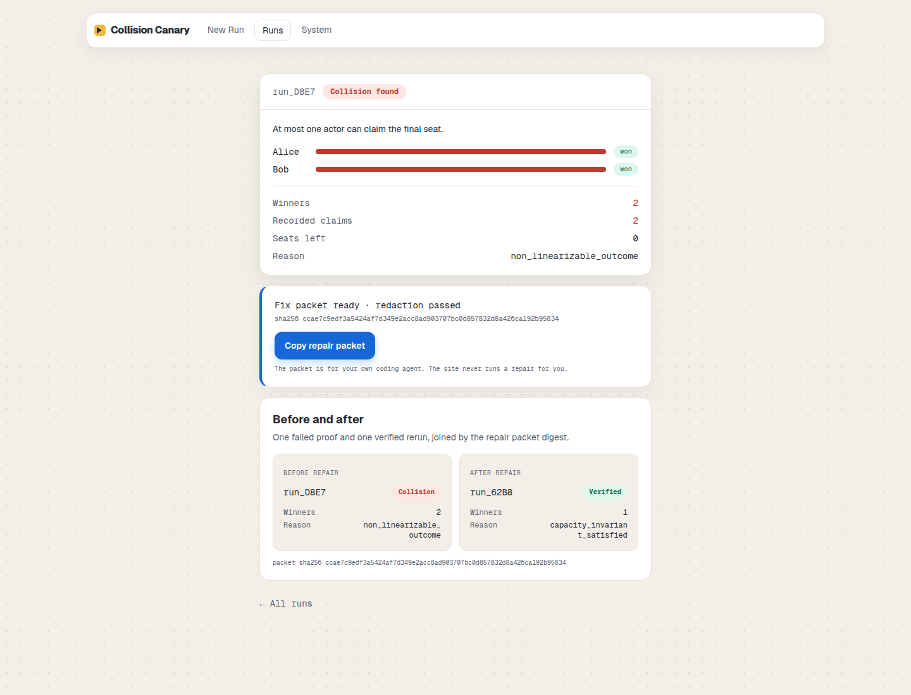
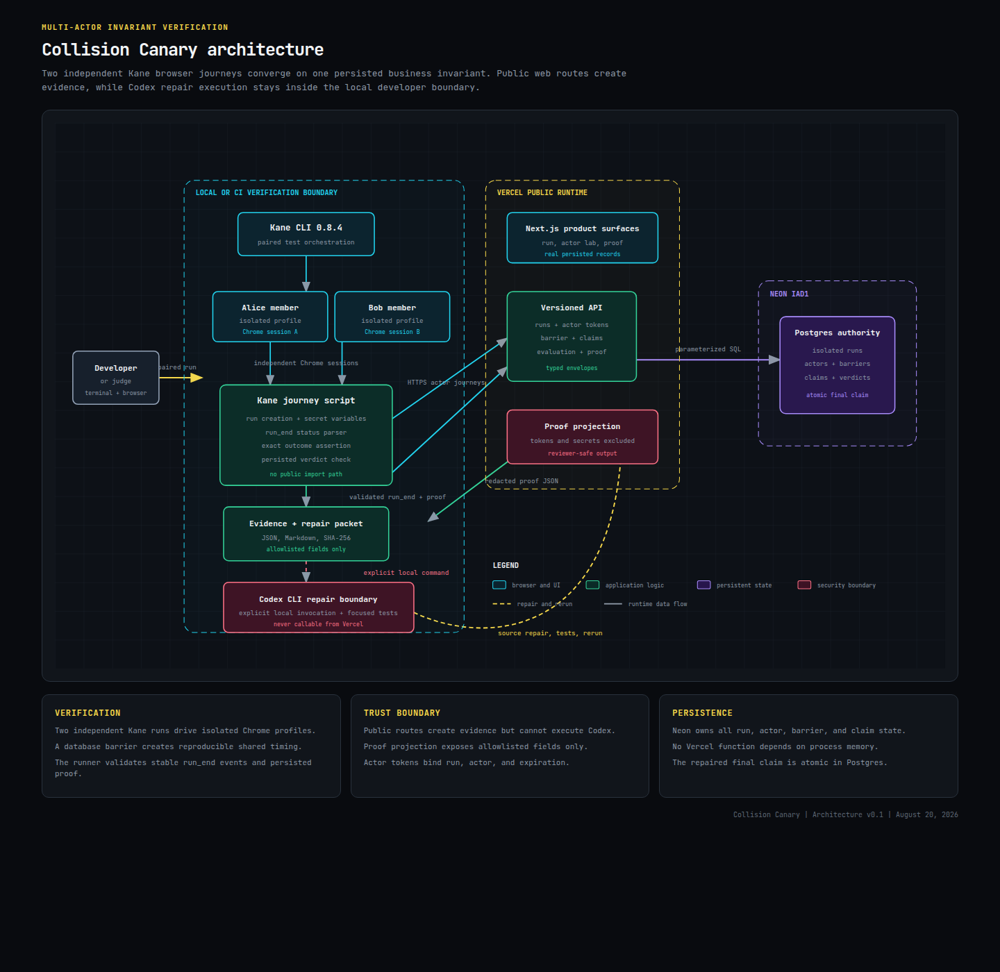

# Collision Canary

**Catch the bug only two users can make.**

Collision Canary drives two real browser actors at the exact same moment and proves whether its bundled last-seat reference app keeps a simple promise: only one person can claim the final seat. Single-user tests never see this class of bug. It only shows up when two people act on one shared record in the same instant, and one row says yes to both.

**Live app: https://collision-canary.vercel.app**

**Demo video: https://drive.google.com/file/d/1oIxXEDN20dNfqA3UdUEC1QTvWWY8IViM/view?usp=sharing**

**Live repair cycle:** [collision proof](https://collision-canary.vercel.app/runs/d8e7fdcb-e92f-4676-88a3-32f1fc957e7d) → [verified Kane rerun](https://collision-canary.vercel.app/runs/62b8a1fc-c555-455b-9d4e-24367a151ef8)



## Try it in about a minute

1. Open the [live app](https://collision-canary.vercel.app) and click **Run the last-seat test**.
2. You receive two tokenized actor links, one for Alice and one for Bob.
3. Point **Kane CLI** at both links to drive two real Chrome browsers, or open each link in its own browser.
4. Both actors arm, wait at a shared barrier, and claim at the same moment.
5. Open the proof. A healthy app shows one winner and one correct rejection. A broken one shows two winners and produces a repair packet.

## How it works

1. Alice and Bob arm against one shared seat.
2. A database barrier releases both actors together.
3. Each actor runs the claim path, which writes a persisted outcome.
4. The evaluator classifies the observed state as satisfied or violated against a declared invariant: at most one actor can claim the seat.
5. A violated run produces a redacted repair packet for a local Codex repair. You re-run and prove the fix.



## Kane CLI

The actor lab at `/lab/last-seat` is a real browser surface built to be driven by Kane CLI. Each run hands out two tokenized actor URLs. Kane opens them as two independent Chrome sessions and performs the arm and claim steps, so the collision is produced by real browsers against real shared state, not by request mocks. The same lab works if you open the two links by hand.

Run the journey yourself with an authenticated Kane CLI:

```bash
bash scripts/kane-last-seat.sh
```

It creates a run, drives Alice and Bob as two parallel Kane browser sessions, and prints the verdict. The healthy result is one winner and one correct rejection.

## What makes it real

- **Real browsers**, driven by Kane, not scripted request mocks.
- **Real shared state**: one Neon Postgres row and a real transaction decide the winner.
- **Evidence-bound repair**: a redacted, hashed packet your coding agent can act on, followed by a verified re-run.

## Proof, not promises

Every run is a real database record. Browse recent runs at [/runs](https://collision-canary.vercel.app/runs) and open any proof to see the real counts, the verdict, and the reason code.

## Tech

Next.js 16 (App Router) with React 19, Tailwind v4, Neon Postgres with Drizzle ORM, deployed on Vercel. Kane CLI drives the browser actors. Codex performs local, evidence-bound repairs.

## API surface

| Route | Purpose |
|---|---|
| `GET /api/v1/health` | Database readiness |
| `GET /api/v1/runs` | List recent runs |
| `POST /api/v1/runs` | Create an isolated run |
| `POST /api/v1/runs/:runId/actors/:actorKey/arm` | Arm one actor |
| `GET /api/v1/runs/:runId/actors/:actorKey/barrier` | Read barrier state |
| `POST /api/v1/runs/:runId/actors/:actorKey/claim` | Attempt the shared claim |
| `POST /api/v1/runs/:runId/evaluate` | Persist an invariant verdict |
| `GET /api/v1/runs/:runId/proof` | Read the redacted proof projection |
| `GET /api/v1/runs/:runId/repair-packet` | Read a violated-run repair packet |

## Run it locally

Requirements: Node.js 22+, pnpm 11+, and Neon (PostgreSQL) credentials.

```bash
pnpm install
vercel env pull .env.local --environment development
pnpm db:migrate
pnpm exec next dev -p 3001
```

Verify the full flow over HTTP:

```bash
COLLISION_CANARY_BASE_URL=http://127.0.0.1:3001 pnpm test:backend-http
```

The same verifier can exercise the local failure fixture and repair packet:

```bash
COLLISION_CANARY_FAILURE_FIXTURE=true COLLISION_CANARY_BASE_URL=http://127.0.0.1:3001 pnpm test:backend-http
```

Focused checks: `pnpm test:actor-guards`, `pnpm test:atomic-claims`, `pnpm test:invariant-evaluator`, `pnpm test:repair-cycle`, `pnpm test:public-base-url`.

## Repair flow

Build a packet from a violated run, apply a local Codex repair, then link the cycle:

```bash
pnpm build:repair-packet -- --run <violated-run-id> --out .collision-canary/runs/<run-id>
pnpm repair:codex -- --packet .collision-canary/runs/<run-id>/repair-packet.json --apply
pnpm link:repair-cycle -- --failed-run <violated-run-id> --verified-run <verified-run-id> --packet .collision-canary/runs/<run-id>/repair-packet.json
```

The Codex adapter defaults to dry-run. `--apply` is an explicit local operation restricted to the backend files named by the packet. It never commits or pushes.

## Trust boundary

- Neon Postgres is the shared-state authority.
- Actor tokens are scoped and handed off through URL fragments, then sent in `Authorization` headers.
- Production actor URLs use `NEXT_PUBLIC_APP_URL` or Vercel's deployment URL, never an untrusted host header.
- Proof projections exclude tokens, credentials, and raw request headers.
- Codex execution is local-only and is never imported by a public route.

## Limitations

A proof describes one observed run. It does not claim exhaustive verification of every possible schedule. This release ships one last-seat reference scenario rather than an arbitrary target-app adapter. The local failure fixture is disabled in production, and the production claim path stays atomic even if the fixture variable is present.

Read the system decisions in [docs/ARCHITECTURE.md](docs/ARCHITECTURE.md) and the visual system in [docs/DESIGN.md](docs/DESIGN.md).

## License

MIT. See [LICENSE](LICENSE).
