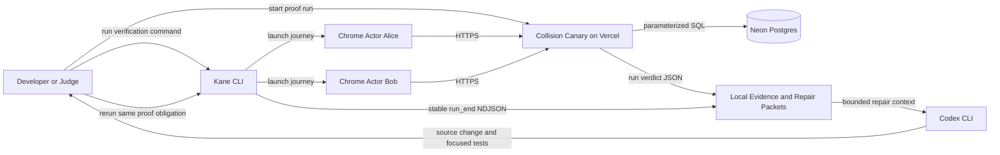

# Collision Canary Architecture

## Document control

| Field | Value |
|---|---|
| Status | Approved for implementation planning |
| Architecture owner | MystiqueMide |
| Runtime | Next.js 16 on Vercel |
| Database | Neon Postgres in `iad1` |
| Browser verifier | Kane CLI 0.8.4 |
| Repair agent | Codex CLI |
| Core boundary | Public web runtime cannot execute Codex or shell commands |

## System objective

Collision Canary coordinates multiple real browser actors against one isolated shared resource, then evaluates whether their combined outcomes satisfy a declared business invariant. It must preserve a clear trust boundary between browser evidence, application records, database state, and coding-agent changes.

## Context diagram



## Deployment topology

```text
Local or CI verification boundary
  collision-canary CLI
    Kane CLI 0.8.4
      Chrome session: Alice
      Chrome session: Bob
    NDJSON terminal parser
    invariant evaluator client
    redaction and repair packet writer
    Codex CLI adapter, explicit local invocation only

Public application boundary
  Vercel project: collision-canary
    Next.js 16 App Router
      product pages
      actor lab pages
      versioned route handlers
      proof projection layer

Persistent state boundary
  Neon project: collision-canary-db, region iad1
    verification runs
    scenario resources
    actors and outcomes
    barriers
    invariant evaluations
    repair cycle links
```

## Architectural layers

### Presentation layer

- Landing page with the product thesis and live proof entry point.
- Run creation page with known invariant templates.
- Actor lab page used by Kane-controlled browser sessions.
- Proof page with invariant, actor timeline, final state, verdict, and repair-cycle link.
- All status states include text labels and do not rely on color alone.

### Application layer

- Run service creates isolated resources and signed actor tokens.
- Barrier service registers readiness and releases actors when the expected count arrives.
- Claim service applies the scenario's state transition.
- Evaluation service checks actor outcomes and final state against the invariant.
- Proof projection service exposes a redacted reviewer-facing result.

### Orchestration layer

- Local Node.js command creates a run and generates actor variable files.
- Kane executes two committed `*_test.md` members in parallel.
- The adapter parses only stable `run_end` events from each process.
- The adapter fetches the aggregate application verdict.
- Failure produces JSON and Markdown repair packets.
- Codex execution requires a separate explicit local command.

### Persistence layer

- Neon Postgres is the only source of shared runtime state.
- All records are scoped by `run_id`.
- No Vercel function relies on module-level or process memory.
- Database constraints and atomic updates enforce the repaired invariant.

## Repository structure

```text
collision-canary/
  assets/
    brand/
    diagrams/
  docs/
    PRD.md
    ARCHITECTURE.md
    DESIGN.md
    TASKS.md
  scripts/
    verify-pair.mjs
    build-repair-packet.mjs
    repair-with-codex.mjs
  src/
    app/
      api/v1/
      lab/last-seat/
      run/
      runs/[runId]/
    components/
    modules/
      actors/
      barriers/
      claims/
      evidence/
      invariants/
      repair-cycles/
      runs/
    lib/
      db/
      env/
      security/
  tests/
    integration/
    unit/
  .testmuai/
    context.md
    tests/
    variables/
  .env.example
  memory.md
  README.md
```

## Domain model

### `verification_runs`

| Column | Type | Constraints | Purpose |
|---|---|---|---|
| `id` | UUID | Primary key | Stable proof-run identifier. |
| `scenario_key` | text | Not null | Versioned scenario such as `last-seat-v1`. |
| `invariant_key` | text | Not null | Versioned invariant such as `capacity-at-most-one-v1`. |
| `status` | text | Checked enum | `created`, `armed`, `released`, `evaluating`, `failed`, `verified`, `infra_error`. |
| `repair_cycle_id` | UUID | Nullable foreign key | Links before and after runs. |
| `created_at` | timestamptz | Not null | Run creation time. |
| `released_at` | timestamptz | Nullable | Barrier release time. |
| `completed_at` | timestamptz | Nullable | Terminal time. |

### `scenario_resources`

| Column | Type | Constraints | Purpose |
|---|---|---|---|
| `id` | UUID | Primary key | Shared resource identifier. |
| `run_id` | UUID | Unique foreign key | Guarantees one isolated resource per run. |
| `capacity` | integer | Check greater than zero | Initial capacity. |
| `remaining` | integer | Check zero through capacity | Authoritative remaining capacity. |
| `version` | integer | Not null | Optimistic state version for evidence. |
| `updated_at` | timestamptz | Not null | Last mutation time. |

### `run_actors`

| Column | Type | Constraints | Purpose |
|---|---|---|---|
| `id` | UUID | Primary key | Actor record. |
| `run_id` | UUID | Foreign key | Run scope. |
| `actor_key` | text | Unique with `run_id` | `alice` or `bob`. |
| `display_name` | text | Not null | Reviewer-facing label. |
| `status` | text | Checked enum | `created`, `armed`, `released`, `claiming`, `succeeded`, `rejected`, `errored`. |
| `armed_at` | timestamptz | Nullable | Readiness time. |
| `request_at` | timestamptz | Nullable | Claim request time. |
| `completed_at` | timestamptz | Nullable | Outcome time. |
| `outcome_code` | text | Nullable | Versioned result code. |

Unique constraint: `(run_id, actor_key)`.

### `run_barriers`

| Column | Type | Constraints | Purpose |
|---|---|---|---|
| `run_id` | UUID | Primary and foreign key | Run-scoped barrier. |
| `expected_count` | integer | Equals two in V1 | Required actor count. |
| `arrived_count` | integer | Check zero through expected count | Atomic readiness counter. |
| `release_version` | integer | Not null | Monotonic release marker. |
| `released_at` | timestamptz | Nullable | Shared release timestamp. |

Barrier arrival uses one database transaction with an idempotent actor-state transition and atomic count update.

### `claim_attempts`

| Column | Type | Constraints | Purpose |
|---|---|---|---|
| `id` | UUID | Primary key | Attempt record. |
| `run_id` | UUID | Foreign key | Run scope. |
| `actor_id` | UUID | Unique foreign key | One claim attempt per actor. |
| `resource_id` | UUID | Foreign key | Target resource. |
| `result` | text | Checked enum | `succeeded`, `rejected`, `errored`. |
| `observed_remaining` | integer | Not null | Resource value returned to the actor. |
| `created_at` | timestamptz | Not null | Attempt completion time. |

### `invariant_evaluations`

| Column | Type | Constraints | Purpose |
|---|---|---|---|
| `id` | UUID | Primary key | Evaluation identifier. |
| `run_id` | UUID | Unique foreign key | One terminal evaluation per run. |
| `verdict` | text | Checked enum | `violated`, `satisfied`, `infra_error`. |
| `successful_claims` | integer | Not null | Observed successful outcomes. |
| `persisted_claims` | integer | Not null | Persisted successful records. |
| `final_remaining` | integer | Not null | Authoritative resource state. |
| `reason_code` | text | Not null | Stable machine-readable reason. |
| `evaluated_at` | timestamptz | Not null | Evaluation time. |

### `repair_cycles`

| Column | Type | Constraints | Purpose |
|---|---|---|---|
| `id` | UUID | Primary key | Repair cycle identifier. |
| `failed_run_id` | UUID | Unique foreign key | Historical failed run. |
| `verified_run_id` | UUID | Nullable unique foreign key | Successful rerun. |
| `packet_sha256` | text | Not null | Integrity reference for redacted packet. |
| `created_at` | timestamptz | Not null | Cycle creation time. |

## State machines

### Verification run

```text
created
  -> armed
  -> released
  -> evaluating
  -> failed | verified | infra_error
```

Terminal states cannot transition. A repaired execution creates a new run linked through `repair_cycles`.

### Actor

```text
created
  -> armed
  -> released
  -> claiming
  -> succeeded | rejected | errored
```

Each transition uses a conditional database update. Duplicate requests return the current state without replaying the action.

## Concurrency design

### Readiness barrier

1. Alice and Bob open actor-specific pages with signed, run-scoped tokens.
2. Kane arms each actor through a visible control.
3. The server records each first arrival and increments `arrived_count` atomically.
4. Actor pages poll barrier status with bounded backoff.
5. When the second unique actor arrives, the server sets `released_at` and increments `release_version` in the same transaction.
6. Both browser clients observe the release and call the claim endpoint.

The barrier creates reproducible overlap without relying on fixed clock sleeps. Network scheduling remains real and observable.

### Historical failing implementation

The local pre-fix build performs a check-then-write claim sequence inside the isolated lab. The run-scoped barrier maximizes the overlap and Kane records both actors receiving success. This implementation is never deployed publicly and is removed by the repair commit.

### Final repaired implementation

The production claim path performs an atomic conditional update:

```sql
UPDATE scenario_resources
SET remaining = remaining - 1,
    version = version + 1,
    updated_at = now()
WHERE id = $1
  AND run_id = $2
  AND remaining > 0
RETURNING remaining, version;
```

If no row returns, the actor receives `seat_unavailable`. The successful transaction records one successful claim, and the rejected attempt is recorded separately. A database transaction binds resource mutation, actor outcome, and attempt record.

## Invariant evaluation

V1 evaluates the rule `successful_claims <= capacity` and cross-checks three sources:

1. Actor-visible results recorded by the application.
2. Successful claim-attempt records.
3. Final resource state.

For capacity one, the satisfied terminal state is:

```text
successful actor outcomes = 1
persisted successful claims = 1
final remaining = 0
rejected actor outcomes = 1
```

Two successful actor outcomes cannot be explained by any valid sequential order and produce `violated: non_linearizable_outcome`.

## API contracts

All endpoints use `/api/v1`, JSON, UTC timestamps, and a response envelope with `data`, `error`, and `requestId`.

### `GET /api/v1/health`

Checks application and database readiness.

Success response:

```json
{
  "data": {
    "status": "ready",
    "database": "ready",
    "version": "0.1.0"
  },
  "error": null,
  "requestId": "req_..."
}
```

### `POST /api/v1/runs`

Request:

```json
{
  "scenarioKey": "last-seat-v1",
  "invariantKey": "capacity-at-most-one-v1"
}
```

Response includes `runId`, `actorUrls`, `proofUrl`, and actor tokens embedded only in their URLs. Tokens are never returned by the proof projection.

### `POST /api/v1/runs/{runId}/actors/{actorKey}/arm`

Headers:

- `Authorization: Bearer <actor-token>`
- `Idempotency-Key: <uuid>`

Behavior:

- Validates token scope, actor, run, and expiry.
- Transitions the actor from `created` to `armed` once.
- Registers unique barrier arrival.
- Returns current barrier count and release state.

### `GET /api/v1/runs/{runId}/actors/{actorKey}/barrier`

Returns `waiting` or `released` with `releaseVersion`. Requires the actor token.

### `POST /api/v1/runs/{runId}/actors/{actorKey}/claim`

Requires actor token and idempotency key. Applies the scenario transition once and returns:

```json
{
  "data": {
    "outcome": "succeeded",
    "message": "Alice claimed the final seat.",
    "remaining": 0
  },
  "error": null,
  "requestId": "req_..."
}
```

Rejected claims use HTTP 409 with `error.code = "seat_unavailable"` and a truthful user-facing message.

### `POST /api/v1/runs/{runId}/evaluate`

Idempotently evaluates a terminal run once both actor outcomes exist or a bounded timeout expires.

### `GET /api/v1/runs/{runId}/proof`

Returns a redacted proof projection with invariant, timeline, actor outcomes, final resource state, verdict, infrastructure status, and linked repair cycle. It never returns actor tokens, request headers, database identifiers, or raw Kane account URLs.

## Kane integration

### Committed test members

```text
.testmuai/tests/last-seat/alice_claim_test.md
.testmuai/tests/last-seat/bob_claim_test.md
```

Each test:

1. Opens its actor URL through a variable.
2. Confirms actor identity and one remaining seat.
3. Arms the claim.
4. Waits for visible barrier release.
5. Stores the visible outcome as `actor_outcome`.
6. Stores remaining capacity as `remaining_capacity`.
7. Confirms a terminal status is visible.

Execution:

```text
kane-cli testrun run .testmuai/tests/last-seat --parallel 2 --headless --name last-seat-pair
```

The local adapter may use two direct `kane-cli testmd run --agent` processes when actor-specific variable isolation requires it. Both paths preserve independent Chrome sessions and stable terminal parsing.

### NDJSON contract

- Ignore progress-event fields for automation decisions.
- Parse the event where `type` equals `run_end`.
- Require a terminal `status`, `summary`, `final_state`, and process exit code.
- Map exit codes 2 and 3 to infrastructure error.
- Treat missing `run_end` as infrastructure error.

## Repair packet

Output directory:

```text
.collision-canary/runs/{runId}/
  verdict.json
  repair-packet.json
  repair-packet.md
  kane-alice.ndjson
  kane-bob.ndjson
```

Packet fields:

- Schema version.
- Scenario and invariant keys.
- Failed run ID.
- Actor-visible outcomes.
- Persisted outcome summary.
- Final resource state.
- Stable reason code.
- Relevant backend route and module names.
- Kane terminal summaries and evidence references.
- Explicit secret-redaction report.
- Required acceptance criteria for the repair.

The repair packet excludes model prompts, database URLs, tokens, cookies, raw headers, and unrestricted filesystem instructions.

## Codex boundary

`repair-with-codex.mjs` is a local developer command. It is never imported into the Next.js application and never reachable through an API route. It validates that the packet belongs to the current repository, runs with an explicit working directory, restricts the prompt to the failed acceptance criteria, and requires tests before reporting completion.

No public user can trigger Codex, shell commands, Git changes, commits, pushes, or deployments.

## Security model

### Assets

- Neon credentials.
- Actor bearer tokens.
- Run and proof integrity.
- Local Kane account credentials.
- Local Codex session.
- Repair packet contents.

### Threats and controls

| Threat | Control |
|---|---|
| Cross-run record access | Every query includes `run_id`; actor tokens bind run and actor. |
| Replayed arm or claim request | Idempotency keys plus terminal actor-state checks. |
| Forged actor URL | HMAC-signed, expiring actor token using `LAB_SIGNING_SECRET`. |
| Secret exposure in proof | Allowlisted proof projection and redaction tests. |
| Public remote-code execution | Repair adapter exists only under local scripts and is absent from route imports. |
| SQL injection | Parameterized typed query layer and schema validation. |
| Run creation abuse | Bounded scenario catalog, database-backed rate record, isolated resource limits. |
| Cross-site mutation | Same-site cookies where used, origin checks, bearer-token routes, and no ambient privileged session. |
| Double actor registration | Unique `(run_id, actor_key)` and conditional state transitions. |
| Incomplete evidence presented as product failure | Separate `infra_error` verdict and explicit evidence completeness field. |
| Dependency compromise | Lockfile, minimal packages, audit review, and exact SDK type inspection. |

## Privacy

- V1 stores no names beyond the fixed labels Alice and Bob.
- No email, phone, payment, or user account data is required.
- Request IP addresses are not stored in proof records.
- Run records may be expired after the event while sanitized proof exports remain.

## Observability

- Structured server logs include request ID, run ID, route, status, duration, and safe reason code.
- Logs never include tokens, cookies, connection strings, or complete request bodies.
- The proof timeline comes from persisted domain events, not console text.
- Health checks report database reachability without returning provider metadata.

## Environment variables

| Variable | Runtime | Required | Purpose |
|---|---|---|---|
| `DATABASE_URL` | Server | Yes | Pooled Neon connection. |
| `DATABASE_URL_UNPOOLED` | Migration | Yes | Direct Neon connection for schema changes. |
| `LAB_SIGNING_SECRET` | Server | Yes | Signs actor tokens. |
| `NEXT_PUBLIC_APP_URL` | Client and server | Yes | Canonical application URL. |
| `COLLISION_CANARY_BASE_URL` | Local CLI | Yes | Target application for Kane runs. |
| `TESTMU_USERNAME` | Local or CI | Optional | Non-interactive Kane authentication. |
| `TESTMU_ACCESS_KEY` | Local or CI | Optional secret | Non-interactive Kane authentication. |
| `KANE_CLI_CHROME_PATH` | Local or CI | Optional | Non-standard Chrome path. |

## Test strategy

### Unit tests

- Invariant evaluator for satisfied, violated, and infrastructure-error outcomes.
- Actor and run state-transition guards.
- Token signing, expiry, and scope validation.
- Proof projection redaction.
- Repair-packet schema and redaction.

### Database integration tests

- Run creation transaction.
- Unique actor registration.
- Barrier idempotency and atomic release.
- Simultaneous final-seat claims with exactly one success in the repaired path.
- Cross-run isolation.
- Terminal state immutability.

### API tests

- One endpoint at a time with real HTTP requests.
- Schema validation and stable error codes.
- Duplicate idempotency keys.
- Expired or cross-run actor token rejection.

### Kane tests

- Alice and Bob authoring runs.
- Cached replay.
- Parallel paired run.
- Failed historical evidence.
- Repaired verified evidence.
- Evidence-pack validation where the installed CLI supports it.

### Production verification

- `pnpm lint`.
- `pnpm test`.
- `pnpm build`.
- Live `/api/v1/health` check.
- Live run creation, paired actor flow, evaluation, and proof fetch.
- Browser console and network check on the public proof path.

## Failure classification

| Class | Example | Verdict |
|---|---|---|
| Product invariant | Both actors visibly succeed | `violated` |
| Correct business rejection | One actor sees seat unavailable | Contributes to `satisfied` |
| Application error | Claim route returns safe 500 | `infra_error` unless the invariant explicitly covers recovery |
| Kane setup | Authentication or Chrome unavailable | `infra_error` |
| Kane timeout | No stable terminal event | `infra_error` |
| Evidence mismatch | Application says success but database disagrees | `violated` with `observation_conflict` |

## Architecture decisions

### ADR-001: Next.js monolith for the hackathon

Use one Next.js application for pages and versioned API handlers. This reduces deployment and authentication boundaries while preserving domain modules for later extraction.

### ADR-002: Neon is the shared-state authority

Use Postgres for run state, barriers, and claims. Vercel process memory is explicitly excluded.

### ADR-003: Synchronize through an application barrier

Use a run-scoped database barrier rather than fixed sleeps or assumptions about Kane worker start time.

### ADR-004: Evaluate a narrow linearizability rule

V1 evaluates at-most-capacity outcomes for one known scenario. It does not claim general concurrency proof.

### ADR-005: Keep repair execution local

The public application creates evidence and repair packets. Only an authenticated local developer can invoke Codex.

### ADR-006: Use Kane's stable terminal contract

Automation decisions rely on `run_end` and process exit codes. Progress-event fields remain display-only.

### ADR-007: Capture failure before repair, ship only the repaired path

The vulnerable check-then-write behavior exists only long enough to produce local historical Kane evidence. Production deploys contain the atomic implementation.

## Implementation gate

No backend module, database migration, API route, Kane test file, or repair script may be implemented until MystiqueMide approves the backend start after reviewing the completed preparation package.
